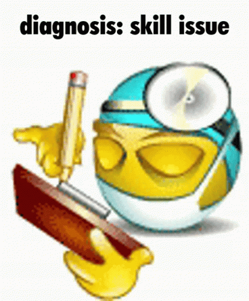

Hi there 👋, my name is **Marco** and I am a **Computer Engineering Student**. I have been working with **ReactJS** and **NodeJS** for the past year. But i know a couple of things in others languages,  love to learn new things, both programming and any technology topic.

I am passionate about **Web Development** and **Software Engineering**. Also interested in **Machine Learning** and **AI**. I am always looking to collaborate on projects and connect with like-minded people. If you would like to collaborate on a project or just chat, feel free to reach out to me.

Many of my projects have been mainly backend based, but I like frontend development just as much.

Wanna chat? you can reach me at:

<!-- want to know more about me? check out my [portfolio](https://marco-portfolio.vercel.app/) -->

Some of the programming languages and technologies that i've worked with:

My GitHub Stats:

